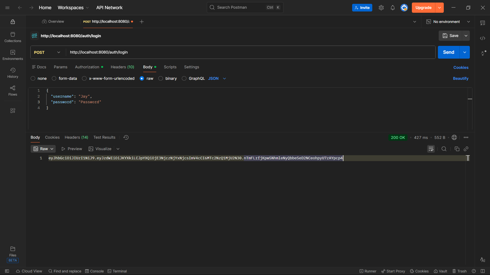
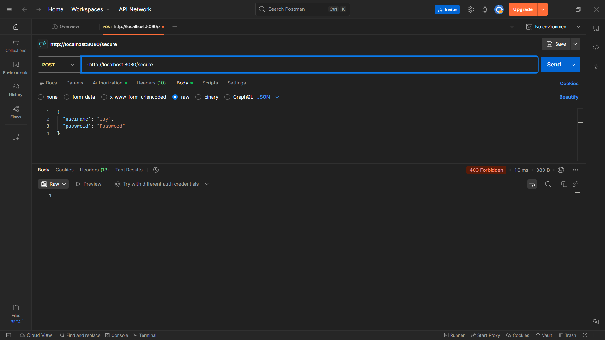
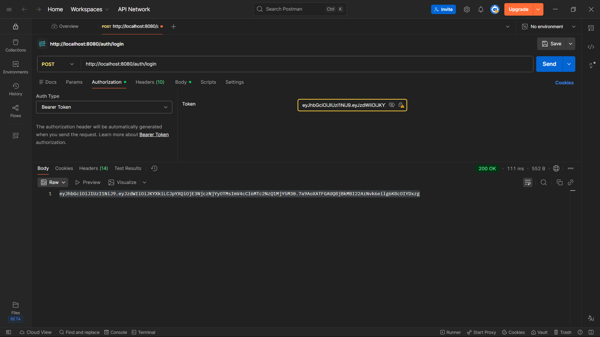
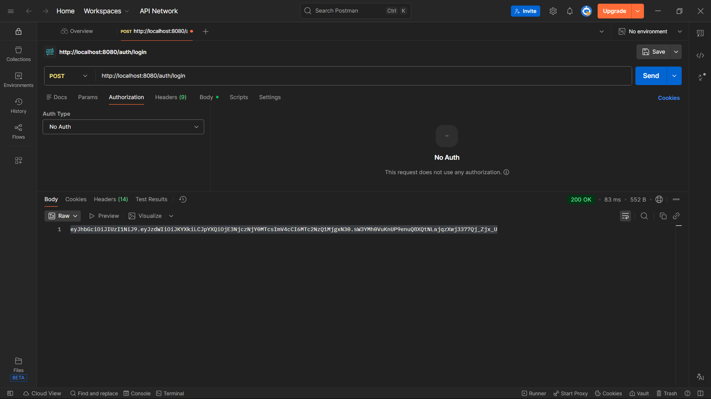

# 🔐 Spring Security JWT Authentication API


---

## 📌 Project Overview

This project demonstrates **JWT-based authentication** using **Spring Boot 3 + Spring Security 6**.

It covers:
- Secure login with username & password
- JWT token generation
- Stateless authentication
- Custom JWT authentication filter
- Securing APIs using Bearer Token
- End-to-end testing using Postman

This project is **interview-ready** and follows **industry-standard security practices**.

---

## 🛠 Tech Stack

| Technology        | Version |
|------------------|---------|
| Java             | 17      |
| Spring Boot      | 3.2.x   |
| Spring Security  | 6.x     |
| JWT (jjwt)       | 0.12.x  |
| Build Tool       | Maven   |
| API Testing      | Postman |

---

## 📂 Project Structure

```

spring-security-jwt-auth-api
│
├── screenshots
│   ├── login-success.png
│   ├── login-no-auth.png
│   ├── secure-without-token.png
│   └── secure-with-token.png
│
├── src/main/java/com/example/security
│   ├── AuthController.java
│   ├── HelloController.java
│   ├── JwtAuthenticationFilter.java
│   ├── JwtUtil.java
│   ├── LoginRequest.java
│   ├── SecurityConfig.java
│   └── SpringSecurityJwtAuthApiApplication.java
│
├── pom.xml
└── README.md

````

---

## 🔑 Authentication Flow

1. Client sends **username & password** to `/auth/login`
2. Spring Security authenticates credentials
3. JWT token is generated and returned
4. Client sends token in `Authorization: Bearer <JWT>`
5. JWT filter validates token
6. Secure APIs are accessed without server-side session

---

## 🔗 API Endpoints

| Method | Endpoint        | Description                         | Auth Required |
|------|-----------------|-------------------------------------|--------------|
| POST | `/auth/login`   | Login & generate JWT                | ❌ No |
| GET  | `/public`       | Public endpoint                     | ❌ No |
| GET  | `/secure`       | Secured endpoint                    | ✅ Yes |

---

## 🧪 API Testing (Postman Proof)

### 1️⃣ Login API – Generate JWT  
**POST** `/auth/login`

**Request Body**
```json
{
  "username": "Jay",
  "password": "Password"
}
````

**Response**

* Returns JWT token



---

### 2️⃣ Secure API WITHOUT Token

**GET** `/secure`

**Expected Result:** `403 Forbidden`



---

### 3️⃣ Secure API WITH Token

**GET** `/secure`

**Header**

```
Authorization: Bearer <JWT_TOKEN>
```

**Expected Result:** `200 OK`



---

### 4️⃣ Login API WITHOUT Authorization Header

**POST** `/auth/login`

**Auth Type:** No Auth
**Expected Result:** `200 OK`



---

## ⚙️ Security Configuration Highlights

* CSRF disabled (REST API)
* HTTP Basic authentication disabled
* Form Login disabled
* Stateless session management
* Custom JWT filter added before `UsernamePasswordAuthenticationFilter`
* In-memory user for demo purpose

---

## 🧠 Key Concepts Implemented

* Authentication vs Authorization
* JWT structure (Header, Payload, Signature)
* Stateless security
* Custom security filter chain
* `AuthenticationManager` usage
* `UserDetailsService`
* Bearer token validation

---

## 🚀 How to Run

```bash
git clone https://github.com/PolakiJayaKrishna/spring-security-jwt-auth-api.git
cd spring-security-jwt-auth-api
mvn spring-boot:run
```

Server starts at:

```
http://localhost:8080
```

---

## 📌 Future Enhancements

* Database-backed users (JPA + MySQL)
* Role-based authorization
* Refresh token implementation
* Exception handling for JWT errors

---

## 👨‍💻 Author

**Polaki Jaya Krishna**
Final Year B.Tech | Java Backend Developer
Focused on **Spring Boot, Security, REST APIs**

---